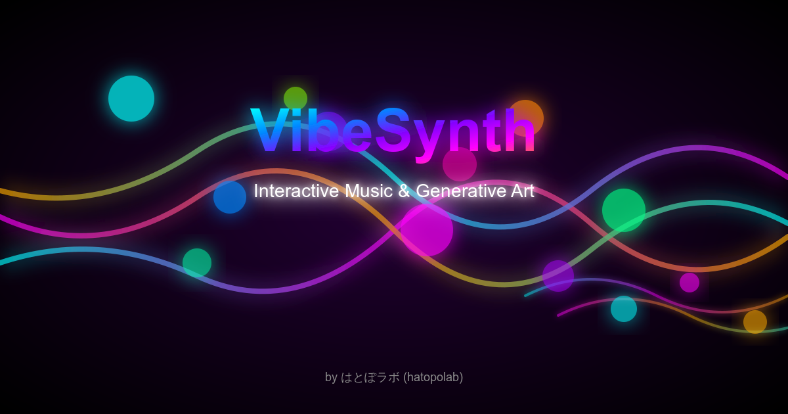

# VibeSynth



インタラクティブな音楽ジェネレーティブアートアプリ。マウス操作で直感的に音とビジュアルを生成し、リアルタイムでループ録音・再生ができます。p5.js と Tone.js を使用した、音楽的なビジュアライゼーションとサンプラー機能を融合したウェブベースの創造的なツールです。

## 🎵 デモ

VibeSynthを実際に体験してみてください：[https://apps.hatopolab.xyz/VibeSynth/](https://apps.hatopolab.xyz/VibeSynth/)

### デモ動画


## ✨ 主な機能

- **直感的な操作**: マウスクリックとドラッグで音とビジュアルを同時に生成
- **ループ録音**: 最大8つの独立したループを録音・再生可能
- **カスタム音色**: 豊富な音色パレットに加え、音色エディタで自由にカスタマイズ
- **パターン自動生成**: AIが生成するようなパターンを自動生成
- **豊富な音階**: メジャー、マイナー、ペンタトニック、ブルースなど14種類のスケールに対応
- **メトロノーム機能**: リズムキープに役立つメトロノーム内蔵
- **タイミング自動補正**: クオンタイズ機能で音楽的な録音をサポート
- **設定管理**: 作成した設定をエクスポート/インポート可能
- **視覚的フィードバック**: 音に反応する美しいパーティクルエフェクトと波形表示
- **調整可能なパラメータ**: BPM、リバーブ、ディレイなどのエフェクトをリアルタイムで調整可能
- **キーボードショートカット**: 素早い操作のための豊富なショートカットキー

## 🚀 使い方

1. 「スタート」ボタンをクリックしてアプリケーションを開始
2. 音色パレットから好みの音色を選択
3. キャンバス上でマウスを動かしてビジュアルを生成、クリックして音を出す
4. ループパッドをクリックして録音を開始
5. 録音中はマウスクリックで音を追加
6. 録音済みのループパッドをクリックするとON/OFFを切り替え可能

> 💡 詳しい操作方法や機能の説明は、アプリ内の「H」キーでアクセスできるヘルプを参照してください。

## 🛠 技術スタック

- [p5.js](https://p5js.org/) - ビジュアル表現のためのJavaScriptライブラリ
- [Tone.js](https://tonejs.github.io/) - Webオーディオフレームワーク
- Node.js - ビルドツールとパッケージ管理

## 📦 インストールと開発

### 基本的な使用方法

このプロジェクトは、基本的にHTMLとJavaScriptファイルからなるシンプルな構成です。開発やテストを行う場合は、以下のステップで行えます：

```bash
# リポジトリをクローン
git clone https://github.com/yourusername/VibeSynth.git

# ディレクトリに移動
cd VibeSynth

# 単純なHTTPサーバーで実行（例: VS Codeの「Live Server」拡張機能など）
```

特別なビルドプロセスは必要なく、HTMLファイルをブラウザで直接開くか、ローカルサーバーで実行できます。

### 本番ビルド（オプション）

本番環境向けにビルドする場合は、以下の手順でキャッシュ対策を適用できます：

1. 必要なパッケージをインストール
```bash
npm install --save-dev gulp gulp-replace del@6 gulp-concat
```

2. gulpfile.jsを作成（以下は例です）
```javascript
const gulp = require('gulp');
const replace = require('gulp-replace');
const del = require('del');

// タイムスタンプをバージョンとして使用
const timestamp = new Date().toISOString().replace(/[^0-9]/g, '').slice(0, 14);

// パス設定
const paths = {
  src: {
    html: 'src/*.html',
    css: 'src/styles/**/*.css',
    js: 'src/*.js'
  },
  dist: 'dist'
};

// クリーンタスク
gulp.task('clean', () => {
  return del([paths.dist]);
});

// HTMLをコピーしてリンクを更新
gulp.task('html', () => {
  return gulp.src(paths.src.html)
    // CSSとJSのリンクを更新（キャッシュ対策）
    .pipe(replace(/(href=["'])(.+?\.css)(["'])/g, `$1$2?v=${timestamp}$3`))
    .pipe(replace(/(src=["'])(.+?\.js)(["'])/g, `$1$2?v=${timestamp}$3`))
    .pipe(gulp.dest(paths.dist));
});

// CSSをコピー
gulp.task('css', () => {
  return gulp.src(paths.src.css)
    .pipe(gulp.dest(paths.dist + '/styles'));
});

// JSをコピー
gulp.task('js', () => {
  return gulp.src(paths.src.js)
    .pipe(gulp.dest(paths.dist));
});

// デフォルトタスク
gulp.task('default', gulp.series(
  'clean',
  gulp.parallel('html', 'css', 'js')
));
```

3. ビルドを実行
```bash
npx gulp
```

4. 生成された`dist`ディレクトリを本番環境にデプロイ

## ⚠️ 現状の制限事項

このアプリはVibe Codingで短期間に作成されたプロトタイプです。現在、以下のような制限があります：

- **コードの肥大化**: `script.js`が1ファイルで肥大化しており、コードベースのメンテナンスが困難
- **未修正のバグ**: いくつかの機能には未修正のバグがあり、期待通りに動作しない場合がある
- **最適化の余地**: パフォーマンスや機能の最適化が必要な箇所がある

## 🔮 今後の展望

- コードベースのリファクタリングとモジュール化
- 既存のバグの修正
- パフォーマンスの最適化
- テストの追加
- UIの改善とレスポンシブデザインの強化

## 📄 ライセンス

このプロジェクトはMITライセンスの下で公開されています - 詳細は[LICENSE](LICENSE)ファイルをご覧ください。

## 👏 クレジット

Original concept by [はとぽラボ (hatopolab)](https://github.com/hatopolab)

### 開発ツール

このプロジェクトの開発と改善には、以下の生成AIツールを積極的に活用しています：

- **[Claude](https://www.anthropic.com/claude)** - 以下の開発段階で活用：
  - 要件定義と機能仕様の明確化
  - UIモックアップと設計案の検討
  - プロジェクトのサムネイル・アイコン制作のアイデア出しと実際の生成
  - コード構造に関するアドバイス
  - バグ解決のためのトラブルシューティング
  - リファクタリング計画の立案
  - ドキュメント作成と品質向上

- **[Cursor](https://cursor.sh/)** - AI搭載コードエディタとして以下に活用：
  - 実際のコード実装とリファクタリング
  - コード補完と最適化提案
  - バグ修正と機能拡張
  - ファイル構造の整理
  - コードレビューとベストプラクティスの適用
  - GitHub管理と環境設定

両ツールを組み合わせることで、アイデア創出から実装、文書化、保守まで、開発ライフサイクル全体を効率化しています。

## 🤝 貢献について

このプロジェクトはVibe Codingの一環としてさくさくと作成したものです。バグレポートや機能要望、プルリクエストは歓迎しますが、メンテナンスに十分な時間を割けない可能性があることをご了承ください。

コードベースは現在最適な状態ではありませんが、興味がある方はぜひフォークして改良してみてください。リファクタリングやモジュール化、バグ修正などの貢献は特に歓迎します。素晴らしいものを作ったら、ぜひ共有してください！ 